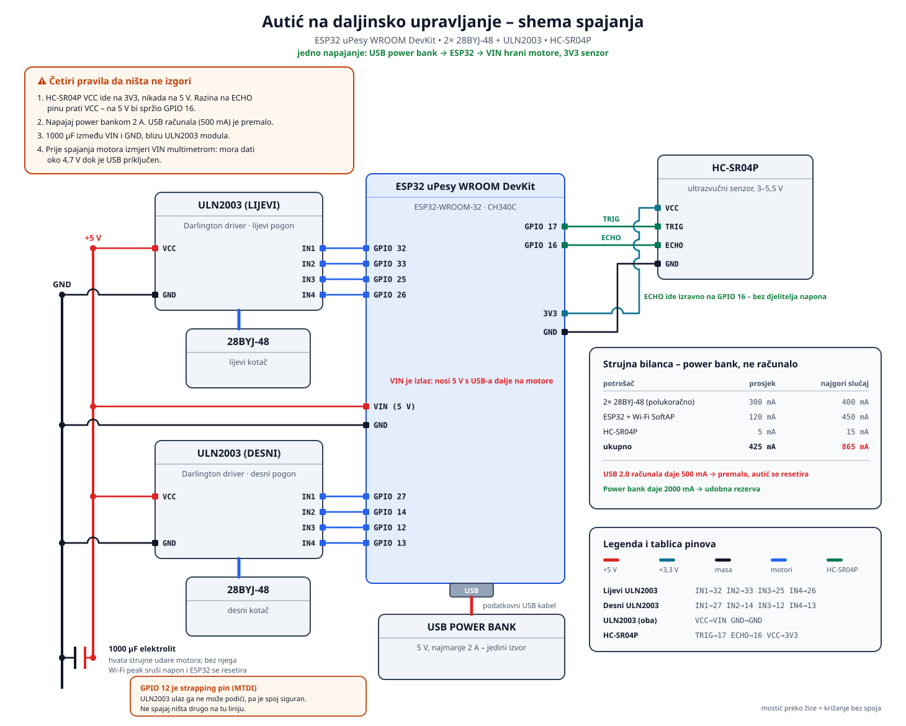

# Shema spajanja



Crta je vektorska ([`shema_spajanja.svg`](shema_spajanja.svg)) pa ostaje oštra na
svakoj veličini — otvori je u pregledniku i otisni odande za prezentaciju.
Generira je [`gen_shema.py`](gen_shema.py); ako promijeniš pinove u
`main/main.c`, promijeni ih i tamo pa ponovno pokreni `python docs/gen_shema.py`.

## Napajanje: jedan izvor

Cijeli autić visi na jednom USB kabelu. Power bank ide u USB konektor ESP32
pločice, a ESP32 dalje razvodi napon:

- **VIN pin (5 V)** → VCC oba ULN2003 modula, odnosno oba motora
- **3V3 pin** → VCC senzora HC-SR04P
- **GND** → sve mase, automatski zajedničke jer je izvor jedan

VIN se ovdje koristi kao **izlaz**: na njemu je USB napon umanjen za pad na
zaštitnoj diodi, dakle oko 4,7 V. To je dovoljno za 28BYJ-48.

### Zašto power bank, a ne USB port računala

| Potrošač | Prosjek | Najgori slučaj |
|---|---:|---:|
| 2× 28BYJ-48, polukoračno | 300 mA | 400 mA |
| ESP32 + Wi-Fi SoftAP | 120 mA | 450 mA |
| HC-SR04P | 5 mA | 15 mA |
| **Ukupno** | **425 mA** | **865 mA** |

USB 2.0 port daje 500 mA. Kad se poklope korak motora i Wi-Fi odašiljanje,
napon padne, okine se brownout detektor i ESP32 se resetira usred vožnje — u
logu se vidi `Brownout detector was triggered`. Power bank od 2 A ima udobnu
rezervu, a usput autić nije vezan kabelom za stol.

Namoti se gase čim naredba postane STOP (`stepper_28byj48_set_motion` upisuje
nulu na sva četiri izlaza), pa autić u mirovanju vuče samo potrošnju ESP32-a.
Zbog toga motor u mirovanju ne drži položaj — na blagoj kosini se autić može
otkotrljati.

## Tablica pinova

| Modul | Pin modula | ESP32 pin | Napomena |
|---|---|---:|---|
| ULN2003 lijevi | IN1 | GPIO 32 | Redoslijed IN1–IN4 mora ostati točan. |
| ULN2003 lijevi | IN2 | GPIO 33 | |
| ULN2003 lijevi | IN3 | GPIO 25 | |
| ULN2003 lijevi | IN4 | GPIO 26 | |
| ULN2003 desni | IN1 | GPIO 27 | |
| ULN2003 desni | IN2 | GPIO 14 | |
| ULN2003 desni | IN3 | GPIO 12 | **Strapping pin** — vidi napomenu niže. |
| ULN2003 desni | IN4 | GPIO 13 | |
| ULN2003 (oba) | VCC | **VIN** | 5 V s USB-a; nikada 3V3. |
| ULN2003 (oba) | GND | GND | |
| ULN2003 (oba) | konektor motora | 28BYJ-48 | Bijeli 5-pinski utikač. |
| HC-SR04P | TRIG | GPIO 17 | Izlaz ESP32-a. |
| HC-SR04P | ECHO | GPIO 16 | **Izravno**, bez djelitelja — vidi niže. |
| HC-SR04P | VCC | **3V3** | Ovo je ono što ECHO čini sigurnim. |
| HC-SR04P | GND | GND | |

## Zašto baš ovi pinovi

Na ovoj pločici je izveden samo red zaglavlja uz USB konektor — čitano od USB-a
prema gore: 13, 12, 14, 27, 26, 25, 33, 32. Tih osam izlaznih pinova nose oba
motora. Senzor koristi 17 i 16 iz drugog reda.

Nijedan korišteni pin nije rezerviran za unutarnji flash (GPIO 6–11) ni samo-ulazni
(GPIO 34–39).

### GPIO 12 je strapping pin

GPIO 12 (MTDI) pri resetu bira napon flash memorije i **mora biti nizak**, inače se
ploča uopće ne pokrene. Ovdje je spoj svejedno siguran, i to ne slučajno: ULN2003
ulaz ide preko baznog otpornika u Darlington par prema masi, pa takav ulaz može
struju samo vući, nikada je dati — ne može podići pin. Uz to ESP32 na MTDI ima
unutarnji pull-down pri resetu.

Praktična posljedica: **na tu liniju ne spajaj ništa drugo.** Bilo što što je pri
pokretanju podigne na 3,3 V ostavlja pločicu bez pokretanja. Ako ti je GPIO 4
izveden, prebaci `RIGHT_IN3_GPIO` na njega i ova napomena otpada.

## Četiri pravila da ništa ne izgori

1. **HC-SR04P VCC ide na 3V3, nikada na 5 V.** Razina na ECHO pinu prati napon
   napajanja senzora: na 3,3 V senzor vraća 3,3 V i spaja se izravno na GPIO 16.
   Isti senzor napajan s 5 V vraća 5 V i uništio bi pin. Ovo je jedina razlika
   između P verzije i običnog HC-SR04, koji traži 5 V i time i djelitelj napona.
2. **Provjeri da je senzor stvarno P verzija.** Na poleđini piše `HC-SR04P` i
   ima jedan mali čip. Obični HC-SR04 ima tri čipa (MAX232 klon, LM324, EEPROM);
   ako vidiš tri, vrati se na djelitelj 1 kΩ / 2 kΩ na ECHO signalu.
3. **1000 µF elektrolitski kondenzator između VIN i GND**, fizički blizu ULN2003
   modula. Hvata strujne udare koje motori i Wi-Fi rade u istom trenutku.
4. **Izmjeri VIN prije spajanja motora.** S priključenim USB-om multimetar
   između VIN i GND mora pokazati oko 4,7 V. Ako pokaže 0 V, ta pločica VIN
   koristi samo kao ulaz i motore moraš napajati zasebno.

## Varijanta: senzor na vanjskom napajanju 7–12 V

Ovo je zamjenski spoj za slučaj da 3V3 grana na pločici više ne drži napon —
npr. nakon kratkog spoja koji je oštetio regulator. Senzor tada dobiva napon iz
zasebnog izvora, a s ESP32 dijeli samo signale i masu.

### Četiri pravila

1. **7–12 V nikada ne ide izravno na senzor ni na ijedan pin ESP32.** HC-SR04P
   podnosi 3–5,5 V; iznad toga je gotov odmah. Između izvora i senzora **mora**
   stajati regulator.
2. **Regulator mora imati fiksni izlaz.** Podešivi moduli (LM2596 i slični) traže
   da izlaz namjestiš multimetrom prije spajanja; bez njega je to pogađanje koje
   košta senzor.
3. **Masa mora biti zajednička.** Minus vanjskog izvora spaja se na GND pin
   ESP32. Bez toga TRIG i ECHO nemaju zajedničnu referencu i mjerenje ne radi,
   ma koliko napajanje bilo ispravno.
4. **Razina ECHO signala prati napon senzora.** Na 3,3 V ide izravno na GPIO 16;
   na 5 V ide preko djelitelja 1 kΩ / 2 kΩ.

### Varijanta A — regulator na 3,3 V (preporučeno)

Regulator: **LD1117V33** u TO-220 kućištu, ulaz do 15 V, izlaz fiksnih 3,3 V.
Prednost je da **djelitelj napona uopće ne treba**.

| Spoj | Na što ide |
|---|---|
| DC 7–12 V plus | ulaz regulatora (pin 1) |
| DC 7–12 V minus | GND šina |
| Izlaz regulatora (pin 3) | VCC senzora |
| GND regulatora (pin 2) | GND šina |
| GND šina | **GND pin ESP32** |
| TRIG senzora | GPIO 17 |
| ECHO senzora | GPIO 16, izravno |

Kondenzatori: 100 µF na ulazu regulatora, 10 µF na izlazu, oba prema masi.
Nisu obavezni na ovoj struji, ali drže regulator stabilnim.

### Varijanta B — regulator na 5 V

Regulator: **LM7805**, ulaz 7–35 V, izlaz fiksnih 5 V. Češće ga imaš pri ruci, ali
tada ECHO daje 5 V pa **mora** ići preko djelitelja:

```
ECHO ──[ 1 kΩ ]──┬── GPIO 16
                 │
              [ 2 kΩ ]
                 │
              GND šina
```

5 V × 2k / (1k + 2k) = 3,33 V — točno koliko ESP32 podnosi. Ostali spojevi su
isti kao u varijanti A.

### Grijanje regulatora

Senzor vuče oko 15 mA. Na 12 V ulaza i 5 V izlaza regulator troši
(12 − 5) × 0,015 = **0,1 W**. Hladnjak ne treba. Ako se regulator grije osjetno,
nešto je u kratkom spoju — iskopčaj i traži uzrok.

### Što ostaje na ESP32

TRIG i dalje dolazi s GPIO 17. ESP32 daje 3,3 V, što senzor prepoznaje kao logičku
jedinicu bez obzira čime je napajan. Motori i njihovi ULN2003 moduli ostaju
nepromijenjeni.

## Mehanika

Dva motora daju diferencijalni pogon: skretanje nastaje razlikom brzina lijevog i
desnog kotača, kao kod gusjeničara, pa autiću ne treba zaseban servo za upravljanje
prednjim kotačima. Treća točka oslonca je obična kuglica ili kotačić bez pogona.

Ako se autić pri naredbi NAPRIJED vrti u mjestu, jedan motor je montiran obrnuto —
u `main/main.c` promijeni `.invert` zastavicu tog motora umjesto da prespajaš žice.

Power bank je najteži dio autića; montiraj ga nisko i po sredini, inače se pri
skretanju prevrće.
